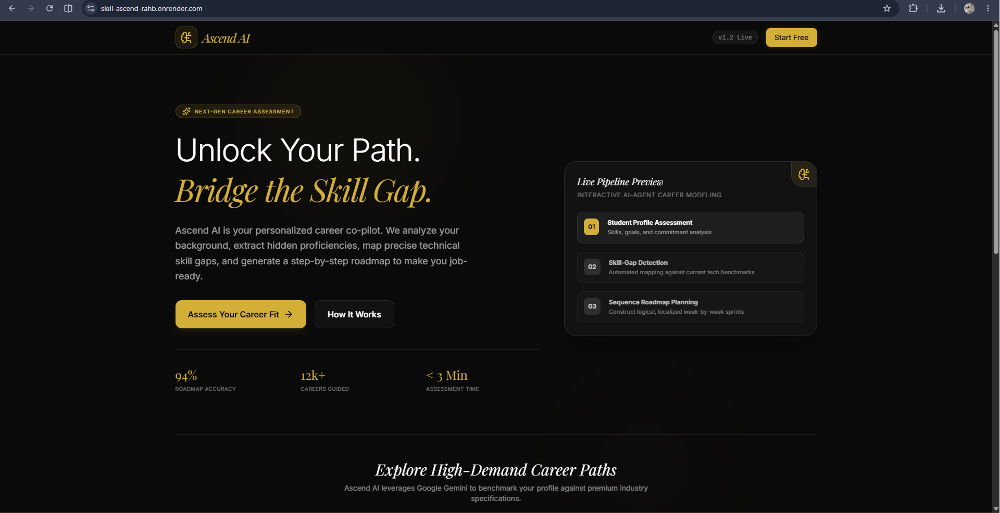
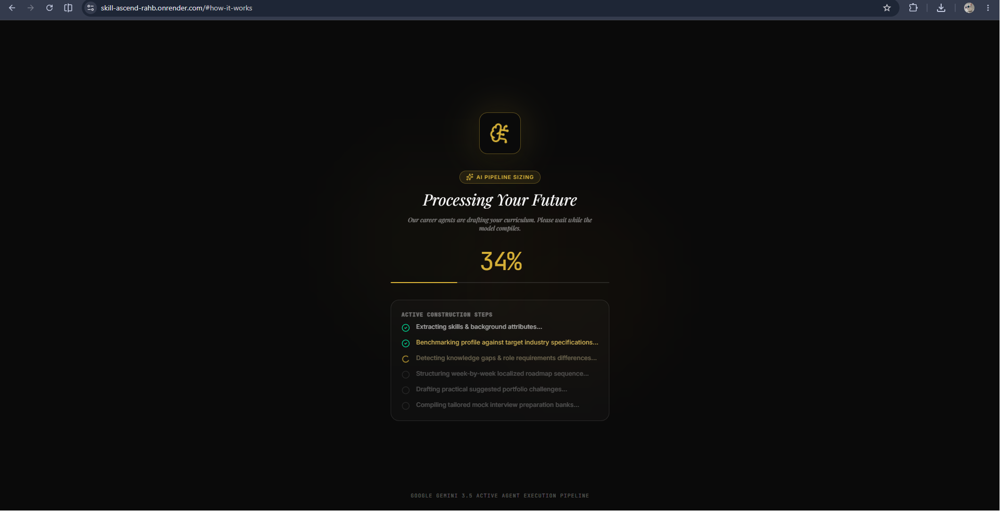
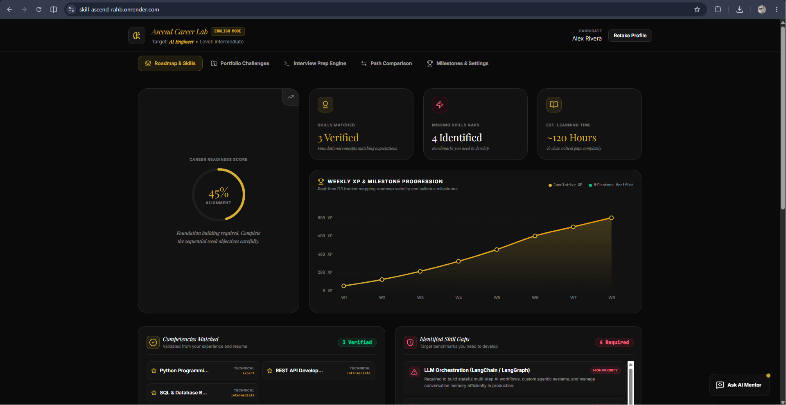
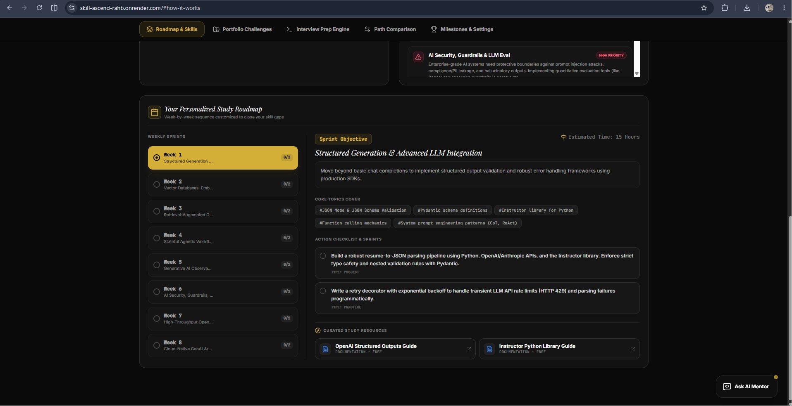
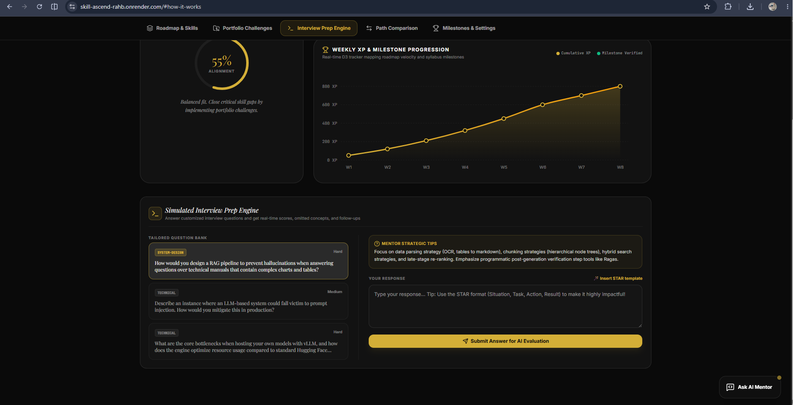
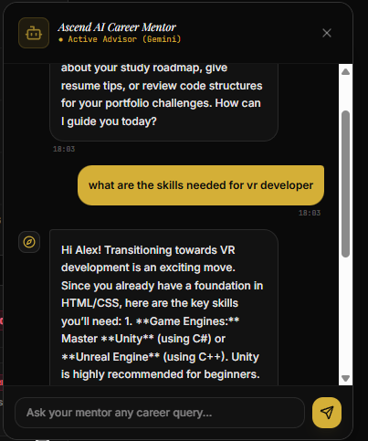

# Skill Ascend 🚀

Skill Ascend is an elite technical career mentorship and skills assessment platform. It generates tailored, highly realistic, and actionable technical learning roadmaps, hand-crafted projects, and interactive interview mock questions matching real-world industry benchmarks.

**Live Deployed Link:** **Live Deployed Link:** [https://skill-ascend-zs5m.onrender.com](https://skill-ascend-zs5m.onrender.com)


**GitHub Repository:** [https://github.com/Dinesh-05-G/Skill-Ascend](https://github.com/Dinesh-05-G/Skill-Ascend)

---

## 📸 Interface & Features Showcase

To visualize the platform's layout and core systems, review the step-by-step app screenshots below:

### 1. Welcome & Landing Hub
*The entry portal where users begin their targeted career alignment journey.*


### 2. Industry Assessment Form
*Ingests candidate skills, target role expectations, confidence level, and weekly commitment.*


### 3. D3.js Weekly XP & Milestone Progression
*An interactive, custom-styled D3.js line chart animating XP levels and checklist completions.*


### 4. Interactive Week-by-Week Syllabus
*Structured, specific study weeks populated with authentic external documentation reference links.*


### 5. Tailored Projects Hub
*Custom production-level project blueprints engineered specifically to bridge found skill gaps.*


### 6. Interactive Mock Interview Engine
*Role-specific situational questions with fully responsive user answers and senior mentor evaluations.*


### 7. Conversational AI Career Mentor
*Floating interactive consultant widget assisting users with on-demand skill gap explanations.*


---

## 🌟 Core Features

### 1. Adaptive AI Mentor & Curriculum Engine
- **Difficulty-Aware Syllabi:** Automatically adjusts timelines and depth according to the target career. For example, a VR Developer roadmap will span an intensive, high-fidelity curriculum featuring low-level mathematics, 3D linear algebra (quaternions, Euler angles), C++, Unity, Unreal Engine, WebXR, and GLSL fragment shaders. In contrast, a modern Frontend Developer roadmap delivers a streamlined React 19, Tailwind CSS v4, and Vite deployment focus.
- **Genuine, Clickable Resources:** Links directly to authentic documentation (e.g., Unity Learn, Unreal Engine Docs, MDN WebXR API, React Docs, Tailwind Guides, and standard web.dev links).
- **Concrete Activities:** Challenges users with physical coding tasks instead of generic topics.

### 2. Live D3.js Tracker & Milestone Chart
- Implements a custom, fully responsive **D3.js line chart** mapped in real-time to the user's weekly XP progression and curriculum module check-offs.
- Interactively triggers smooth CSS/SVG transitions, glows, and custom hover overlays showing detailed task summaries and cumulative progress.

### 3. Integrated Interview Engine
- Features multi-stage career simulation questions customized to your target role and experience tier.
- Users can interactively submit answers and compare them to high-caliber senior developer solutions.

### 4. Hands-on Project Hub
- Recommends three customized, highly practical project blueprints targeted directly at the candidate's discovered skill gaps.

### 5. "Virtual Memory" State Engine
- Keeps users exactly where they left off by syncing state natively with browser storage.
- Safely recovers your custom roadmap, active screen, checkbox ticks, and XP progress, surviving complete Chrome page refreshes and device restarts.

---

## 🛠️ Technology Stack
- **Frontend:** React 18+, TypeScript, Tailwind CSS, Motion (Framer Motion)
- **Data Visualization:** D3.js (Interactive SVG Canvas)
- **Icons:** Lucide React
- **Backend Orchestrator:** Express.js serving Vite assets and proxying Gemini AI queries
- **Model Support:** Gemini 3.5 Flash

---

## 📂 Project Architecture

```
├── src/
│   ├── components/
│   │   ├── AssessmentForm.tsx      # Multi-step profile and experience ingest
│   │   ├── Dashboard.tsx           # Primary workspace & tab container
│   │   ├── WeeklyTimeline.tsx      # Comprehensive weeks view
│   │   ├── XPProgressionChart.tsx  # D3.js Interactive Chart Engine
│   │   ├── ProjectsHub.tsx         # Hand-crafted project gap projects
│   │   └── InterviewEngine.tsx     # Mock interviews & senior developer tips
│   ├── App.tsx                     # Virtual Memory controller & State synchronizer
│   ├── types.ts                    # Strict TypeScript Interfaces
│   └── index.css                   # Global tailwind variables & Space Grotesk typography
├── server.ts                       # Secure Express.js application server
├── metadata.json                   # Platform and Frame metadata
└── package.json                    # Configuration, build & startup targets
```

---

## 🚀 Getting Started

### 1. Install Dependencies
```bash
npm install
```

### 2. Configure Environment Variables
Create a `.env` file in the root directory:
```env
GEMINI_API_KEY=your_gemini_api_key_here
```

### 3. Start Development Server
```bash
npm run dev
```
The server will boot up and bind to `http://localhost:3000`.

### 4. Build for Production
To bundle assets and compile the unified Node.js CommonJS server:
```bash
npm run build
```

### 5. Start Production Server
```bash
npm run start
```

---

## 💡 How It Works (Methodology)

1. **Assessment Ingest:** You provide your current skills, target role (e.g. Frontend Developer, VR Developer, Cloud Architect), and commitment parameters.
2. **Analysis and Assessment:** The backend compiles your profile, assesses your skill gaps against real industry roles, and creates a highly realistic, customized curriculum.
3. **Interactive Tracking:** Read genuine references, click tasks to verify completion, watch your XP rise in the interactive D3 visualizer, and practice tailored interview questions.
4. **Resilient Local Persistence:** Progress is saved continuously. Refresh at will; your dashboard persists instantly.
